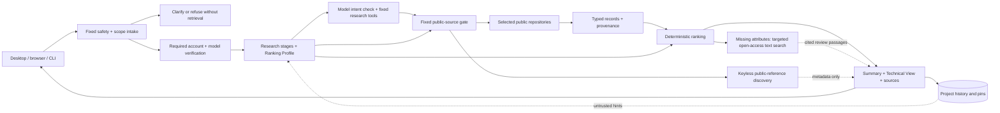

# Design note: public-evidence materials triage

## 1. Deployment and scientist workflow

Labcat is a single-user prototype for public-evidence research across
material classes before experiments. React/TypeScript presents Chat, Report Format, Search Criterion and Connections. FastAPI serves the built UI and the same Python research core
used by the headless CLI. One Docker image supplies three non-root, read-only services: the app, an
isolated Goose worker and a restricted provider-network proxy. Only the app
mounts the named volume retaining research history. Host launchers discover a free
loopback port and reuse the managed service. An optional Tauri shell opens the
system webview, with a normal-browser fallback and no Chrome requirement.

Scientists can start standalone chats or enter a project and start a chat there.
Projects expand into nested sidebar chats; selecting the project opens pinned
contents, while a chat opens its latest Summary and Technical View. A report
pair is one immutable saved result. Sources have many-to-many chat/report links;
pins select reusable contents without copying facts or granting trust. Counts
show pinned reports/resources per chat and distinct totals per project.

SQLite transactions save the prompt, reply, report pair, structured result and
source links together. Retrieval runs outside write transactions. If a chat moves
during retrieval, the save is rejected against its original project scope.
Schema migrations preserve earlier reports and pins, reject unsupported schemas,
and validate foreign keys. Saved transcript text never becomes evidence.

## 2. Evidence and scientific limits

Selected public repositories are searched first. Optional API access and anonymous
adapters provide typed records; automatic mode can fall through to another enabled
repository after an empty or unavailable response. Missing selected attributes
trigger bounded, separate searches in an enabled open-access publication service.
Available article text is skimmed for relevant passages with source and section
attribution. Saved filters and result limits apply; user text supplies search
hints only. There is no fixed production cohort or historical-data fallback.

Reference metadata and literature passages are separate from scored property
evidence. A passage is a review lead until phase, identity, units and conditions
are validated; it cannot fill missing values or change scores. The initial text
body-text adapter reads only available open-access XML from Europe PMC. An enabled
OpenAlex abstract adapter provides bounded property-search fallback within the
same query budget; it never follows publisher links or claims a body read.
Missing coverage and failed requests stay explicit.
Historical saved reports remain unchanged.

Only approved adapters create scientific records. Each result retains material
and phase identity, original property fields, values/units, source URL,
retrieval time, method qualifiers and hashes. Eligibility and ranking must use
available verified fields and the chosen application. Missing or conflicting
stability, compound hazards and film-performance data remain unknown. Negative
formation energy is not a stability substitute; bulk evidence does not qualify
a thin film. Offline evaluation fixtures are explicitly separate from user runs.

The shortlist includes one phase per composition, with deterministic tie-breaking
and a visible audit of exclusions/alternate phases. Ranking uses normalized
preferences, explicit bounded utility functions and recorded contributions.
Selected missing or unsupported attributes contribute zero and remain in the
normalization denominator. Scores are derived preference utilities, not
measurements, calibrated confidence or probabilities. The conservative element
exclusion preset does not establish that a compound is non-toxic.

Summary and Technical View render the same validated result. The Summary
provides a written screening recommendation, a compact shortlist and essential
caveats. The Technical View expands the table and retains detailed provenance.
Report Format previews and exports share validated layout preferences, saved
with each new report. Download format is independent of these readable views. Checkboxes select either
or both views; TXT/JSON and formatted PDF/Word retain saved content. Additional
references appear separately and cannot change eligibility or scores. Database
credentials do not authorize private access; no general scraper or wetlab tool exists.

## 3. Agent and security boundary

The user edition exposes no developer configuration routes. Explicit startup
configuration enables Developer Settings for bounded stage/history controls,
search budgets and a default model connection; fixed source and evidence
boundaries cannot be disabled. Keyed sources require current credential verification.
New research requires a verified provider account and selected model. The Docker image embeds pinned Goose with
all default/profile extensions disabled. The worker has no host folders or
workspace mount, and an internal network with restricted provider egress. The
main API rejects worker access; a separate capability exposes only research
stages. Desktop exports add files to Downloads; Goose cannot browse it.
Goose has one closed-enum suitability tool and two empty-argument research tools:
configured public-reference search and ranked-report generation. Assessment must
accept the materials-research intent before retrieval can execute. It can narrow
the fixed safety decision, never override it. Vague or unrelated questions receive
guiding questions without retrieval.
Harmful operational requests, including weapon manufacture, are refused. These
turns stay in the conversation without manufacturing scientific reports.
The server retains evidence and compiles reports; model prose is discarded.
Research stages, Ranking Profile, source settings and developer limits are recorded.
A model failure rejects the run without saving a report or falling back to local
research. Plain Python uses the same required connection gate and a bounded enum
planner. Docker headless commands use the existing backend and its unlocked
connection through a fixed loopback, CSRF-protected research endpoint.

Project context is bounded and marked untrusted. It contains recent messages
and selected pinned titles/identifiers; arbitrary source text/URLs and report
prose are excluded from model context. Prompt checks reject common requests to
ignore policy, fabricate evidence, use private/paywalled data or perform wetlab
actions before any provider call. This is basic social-engineering resistance,
not a claim that a phrase detector solves prompt injection. Capability isolation
provides the stronger boundary: no shell, arbitrary URL, file or lab tools exist
in the scientific workflow. Source text cannot execute instructions.
Retrieved titles and passages also undergo instruction/hidden-control screening;
rejected paragraphs are counted without retaining attack text. This filter is not
a proof that a source is scientifically reliable or free from every injection.

Network adapters restrict destinations, paths, methods, redirects, response
sizes and timeouts. Public-source adapters reject nonpublic resolution; model endpoints
are fixed except explicitly approved local Ollama addresses. Host/Origin/Fetch
Metadata checks protect local browser writes; connection changes additionally
require a server-session cookie and CSRF token. CSP blocks remote scripts and
framing. This is a loopback single-user application, not authenticated shared
hosting; a cloud service would require identity, authorization and managed egress.

## 4. Configuration, credentials and validation

Search Criterion offers class/application presets, saved custom profiles and
predefined attributes directly grouped by physical-property category. New selections
start at 0.5; sliders and numeric inputs independently range from zero to one.
The active profile appears above the editing preview. The application computes relative weights
and visualizes them. Implemented scoring criteria remain subject to source
availability. Other catalog attributes remain explicit unscored preferences.
Class/application profiles express research preferences across material types;
source adapters and verified fields determine quantitative coverage. Preferences are editable; evidence invariants are
not. A scientist tunes criteria and presentation, an admin configures connections,
and a field engineer adds/test-reviews adapters or utility functions in code.

First-run setup requires model connection and verification, then offers optional
AWS and public-source steps. The workspace runs locally by default. Nonsecret
setup progress persists; it cannot authorize research. Credential-bound readiness
is short-lived and checked before new research; history remains accessible when
locked or disconnected. Profiles remember nonsecret
connection identifiers and explicit hosted-inference consent. Keys are session-only
unless saved to an authenticated encrypted vault. Passphrase-derived keys remain
in memory; a restarted vault stays locked until unlocked. An external key/file
supports administrator-managed unattended use. Atomic writes and validation
report corruption instead of silently choosing an account. The app never asks
for third-party passwords or stores secrets in browser storage, logs or images.
Connection tests perform metadata/identity checks, not billable inference.
ChatGPT uses a provider-owned device login through the pinned Codex helper.
Temporary tokens stay on memory-backed storage; remembered tokens are encrypted.
Available account quota windows and per-run usage are labeled separately.
Claude uses API/Bedrock credentials; subscription login is not implemented.
AWS uses an existing profile/SSO session for optional Bedrock planning; no cloud
resources are provisioned and AWS credentials do not relocate the application.

Evaluations cover broad material discovery and separate scoring fixtures, prompt-supplied false values, attempted
policy override, malicious extra model fields, missing/conflicting data, redirect
and nonpublic-destination rejection, profile normalization, credential redaction,
vault restart/tamper, and project isolation/persistence. Docker tests exercise
both Linux architectures on this Mac (AMD64 emulated); native Windows/Linux and
real account inference require deployment-site verification. Test fixtures check
provider protocols without claiming live authorization. See the validation record
for observed results. The next scientific work is broader verified coverage,
compound hazard evidence and task-level methodology, followed by authenticated
shared deployment if needed.

Public references: [NOMAD](https://nomad-lab.eu/),
[open publication](https://www.nature.com/articles/sdata2016134),
[MP queries](https://docs.materialsproject.org/downloading-data/using-the-api/querying-data),
[MP attribute reference](https://materialsproject.github.io/api/_autosummary/mp_api.client.routes.materials.summary.SummaryRester.html).
