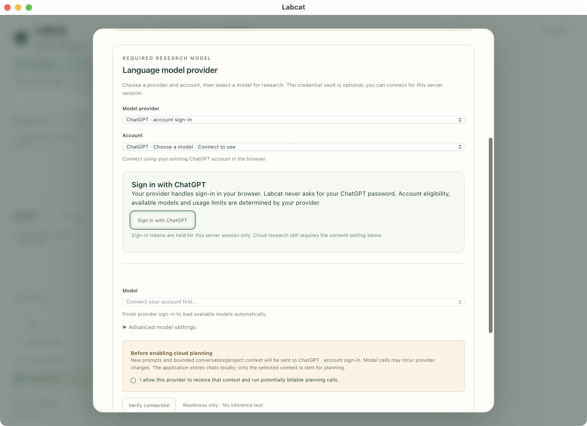
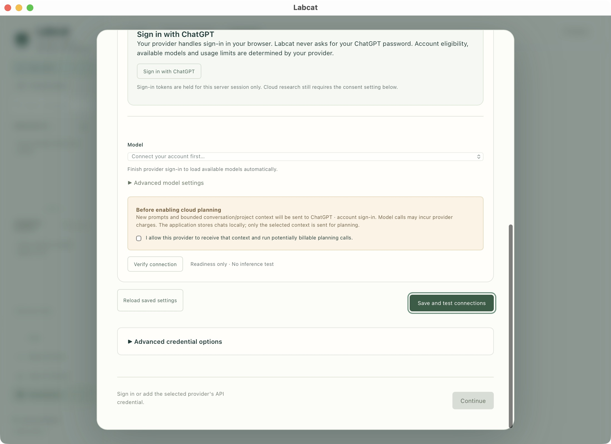
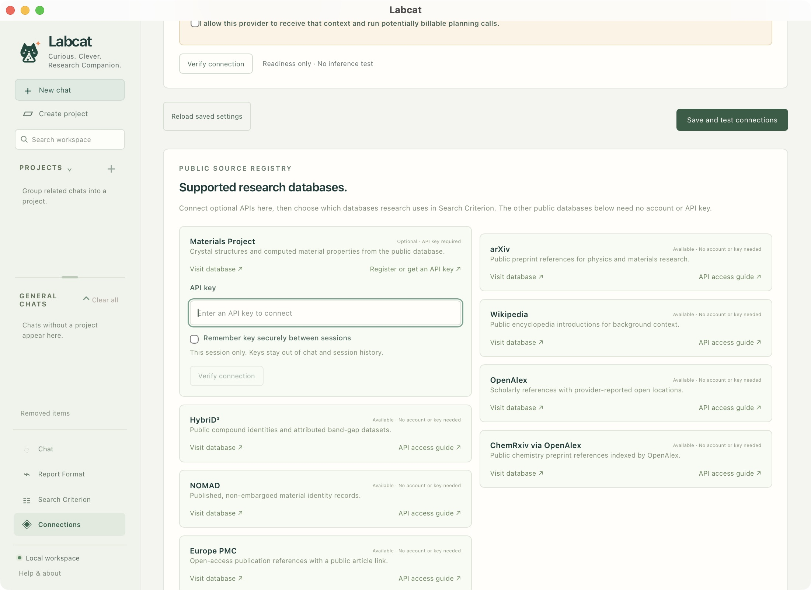
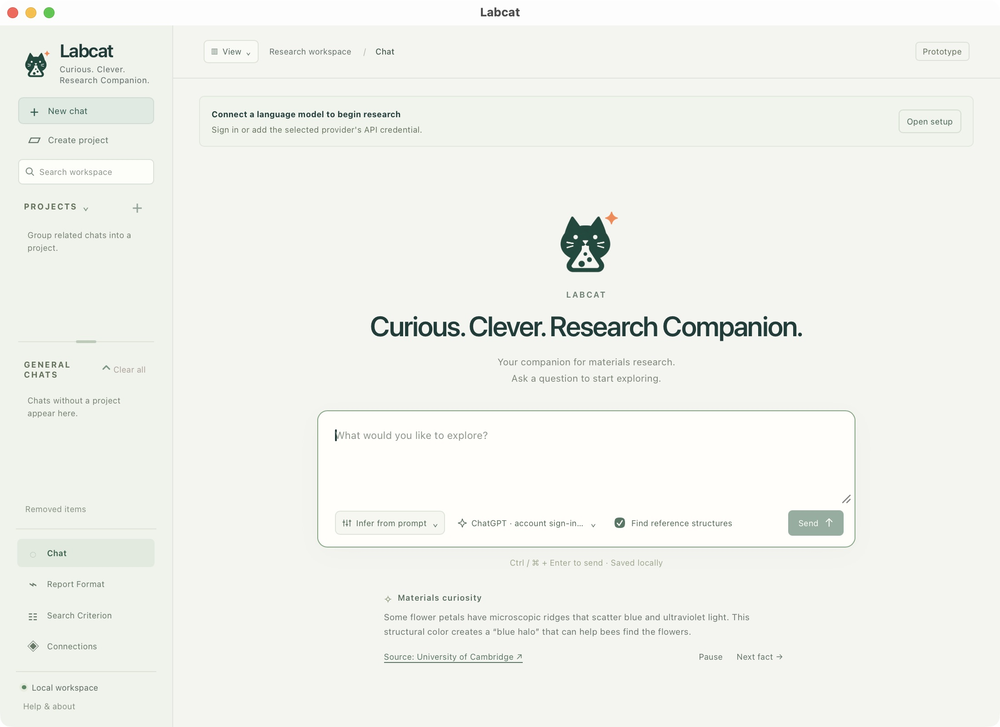
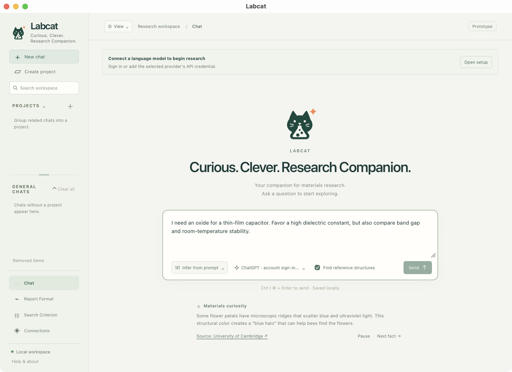

# Install & setup

Run Labcat on your computer with Docker, then use either its desktop application
or your browser.

## 1. Prepare your computer

Install [Git](https://git-scm.com/downloads) and start
[Docker Desktop](https://docs.docker.com/desktop/) on Mac or Windows. Windows
must use Linux containers. On Linux, install
[Docker Engine](https://docs.docker.com/engine/install/) and the
[Compose plugin](https://docs.docker.com/compose/install/linux/).
Use a local Docker context and an internet connection.

In Terminal or PowerShell, check:

```text
git --version
docker info
docker compose version
```

For the desktop application, also install the
[desktop prerequisites](installation.md#desktop-prerequisites).
Browser mode needs no host Python, Node or Rust.

## 2. Download and build

Run in your chosen installation folder:

```sh
git clone https://github.com/kewh5868/labcat.git
cd labcat
docker build -t labcat:0.1.0.dev0 .
```

Wait for a successful build; downloading dependencies can take several minutes.

## 3. Open the application

From the same folder:

| Mac / Linux   | Windows PowerShell |
| ------------- | ------------------ |
| `./labcat.sh` | `.\labcat.cmd`     |

Press **Enter** for **Desktop**, or choose **2** for **Browser**. Desktop builds
and installs a native app for your user; Browser opens your default browser.
The launcher remembers this choice. To choose again, use `./labcat.sh --choose`
or `.\labcat.cmd -Choose`.

The workspace opens with a setup dialog. Keep Docker running during setup and
research; ordinary launches do not need a rebuild.

## 4. Connect your model

The developer recommends **ChatGPT account sign-in**, the most thoroughly tested
connection in Labcat. Your account needs Codex access and available usage
allowance. Other providers have their own model access and billing requirements.

1. Under **Model provider**, select **ChatGPT · account sign-in**.
2. Click **Sign in with ChatGPT**, finish authorization on the provider's page,
   and return to Labcat. Your password belongs on the provider's page.
3. Wait for **Connected**, then select an available **Model**.

<div class="guide-shot" markdown="1">

[](assets/screenshots/setup-sign-in.jpg)

<svg viewBox="0 0 2200 1600" aria-hidden="true" focusable="false">
<rect x="450" y="410" width="1300" height="65" rx="12" />
<circle cx="474" cy="395" r="30" /><text x="474" y="395">1</text>
<rect x="480" y="785" width="265" height="82" rx="12" />
<circle cx="504" cy="770" r="30" /><text x="504" y="770">2</text>
<rect x="450" y="1097" width="1300" height="68" rx="12" />
<circle cx="474" cy="1082" r="30" /><text x="474" y="1082">3</text>
</svg>

</div>

<p class="guide-caption">1. Choose the model provider. 2. Start provider sign-in. 3. Select a model after connection.</p>

_Before sign-in. Model choices load after the account connects._

Then save the connection:

1. Read and enable the consent checkbox for sending research context to your
   provider.
2. Click **Save and test connections**. After verification, click **Continue**.
   A saved connection may offer **Verify and continue** instead.

<div class="guide-shot" markdown="1">

[](assets/screenshots/setup-save.jpg)

<svg viewBox="0 0 2200 1600" aria-hidden="true" focusable="false">
<rect x="478" y="836" width="1242" height="48" rx="12" />
<circle cx="502" cy="821" r="30" /><text x="502" y="821">1</text>
<rect x="1462" y="1055" width="328" height="77" rx="12" />
<circle cx="1486" cy="1040" r="30" /><text x="1486" y="1040">2</text>
<rect x="1616" y="1400" width="173" height="84" rx="12" />
<circle cx="1640" cy="1385" r="30" /><text x="1640" y="1385">3</text>
</svg>

</div>

<p class="guide-caption">1. Consent to sending research context. 2. Save and test connections. 3. Continue once ready.</p>

_Continue remains unavailable until the required connection is ready. This
readiness check does not run a research query._

The credential vault is optional. Session credentials work without a vault;
encrypted storage can remember supported credentials between server sessions.
Saved key values are never displayed back in the browser.

## 5. Choose sources and finish

In **Public sources**, keep the default sources for a first run. Optionally enter
a Materials Project API key on its card and select **Save and verify**.
The card is also in **Connections**.

<div class="guide-shot" markdown="1">

[](assets/screenshots/sources.jpg)

<svg viewBox="0 0 2200 1600" aria-hidden="true" focusable="false">
<rect x="990" y="700" width="280" height="66" rx="12" />
<circle cx="1014" cy="685" r="30" /><text x="1014" y="685">1</text>
<rect x="505" y="805" width="755" height="84" rx="12" />
<circle cx="529" cy="790" r="30" /><text x="529" y="790">2</text>
<rect x="504" y="982" width="220" height="77" rx="12" />
<circle cx="528" cy="967" r="30" /><text x="528" y="967">3</text>
</svg>

</div>

<p class="guide-caption">1. Get a Materials Project key. 2. Enter the key. 3. Verify the connection. This card is shown on Connections.</p>

Choose **Continue**, then **Finish setup** on the **Ready** step. See
[Sources & methods](resources.md) for each connected repository and its access
requirements. Anonymous sources remain available without a Materials Project key.

## 6. Ask a question

Choose **New chat** in the sidebar. **Create project** groups related chats;
the [user guide](user-guide.md) shows the project workflow.

<div class="guide-shot" markdown="1">

[](assets/screenshots/workspace.jpg)

<svg viewBox="0 0 2200 1600" aria-hidden="true" focusable="false">
<rect x="32" y="204" width="313" height="78" rx="12" />
<circle cx="56" cy="189" r="30" /><text x="56" y="189">1</text>
<rect x="43" y="283" width="295" height="54" rx="12" />
<circle cx="67" cy="268" r="30" /><text x="67" y="268">2</text>
<rect x="32" y="343" width="313" height="68" rx="12" />
<circle cx="56" cy="328" r="30" /><text x="56" y="328">3</text>
<rect x="41" y="1260" width="296" height="194" rx="12" />
<circle cx="65" cy="1245" r="30" /><text x="65" y="1245">4</text>
</svg>

</div>

<p class="guide-caption">1. New chat. 2. Create project. 3. Search saved work. 4. Report Format, Search Criterion and Connections.</p>

Paste this into the prompt box:

> I need an oxide for a thin-film capacitor. Favor a high dielectric constant,
> but also compare band gap and room-temperature stability.

Leave **Infer from prompt** selected and **Find reference structures** checked.
Check the model, then click **Send**, or press **Command + Enter** on Mac and
**Ctrl + Enter** on Windows/Linux.

<div class="guide-shot" markdown="1">

[](assets/screenshots/composer.jpg)

<svg viewBox="0 0 2200 1600" aria-hidden="true" focusable="false">
<rect x="716" y="926" width="1150" height="173" rx="12" />
<circle cx="740" cy="911" r="30" /><text x="740" y="911">1</text>
<rect x="728" y="1112" width="260" height="76" rx="12" />
<circle cx="752" cy="1097" r="30" /><text x="752" y="1097">2</text>
<rect x="995" y="1112" width="636" height="76" rx="12" />
<circle cx="1019" cy="1097" r="30" /><text x="1019" y="1097">3</text>
<rect x="1723" y="1112" width="146" height="77" rx="12" />
<circle cx="1747" cy="1097" r="30" /><text x="1747" y="1097">4</text>
</svg>

</div>

<p class="guide-caption">1. Write the research question. 2. Choose automatic or saved criteria. 3. Check model and reference-structure lookup. 4. Send after connecting.</p>

If Labcat asks for clarification, reply in the same chat. Continue with the illustrated
[user guide](user-guide.md) to read, compare and export results, or try the
[examples](examples.md).
