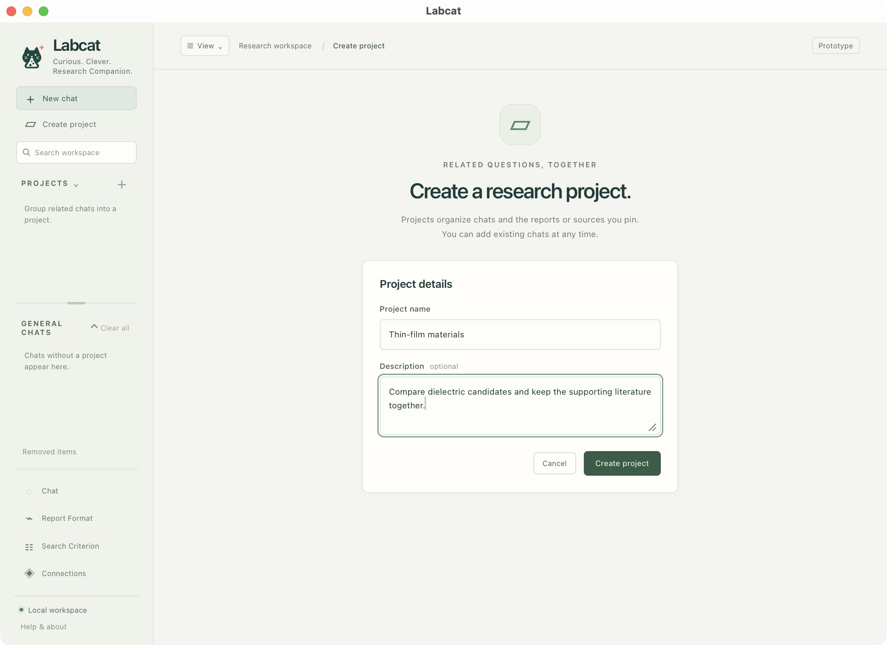
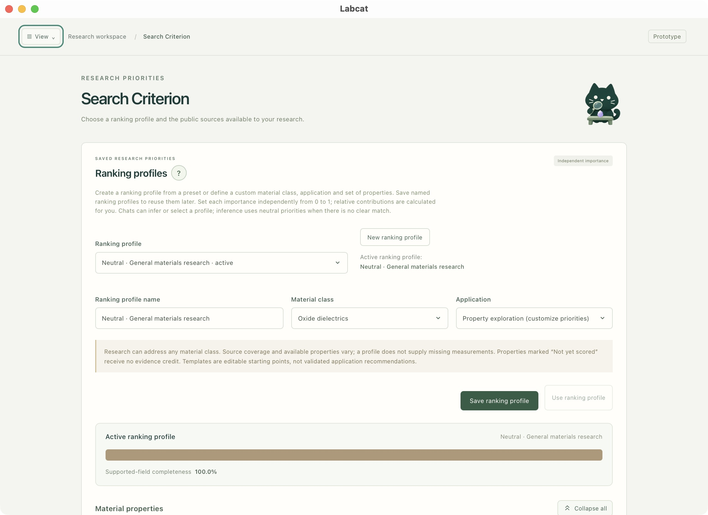
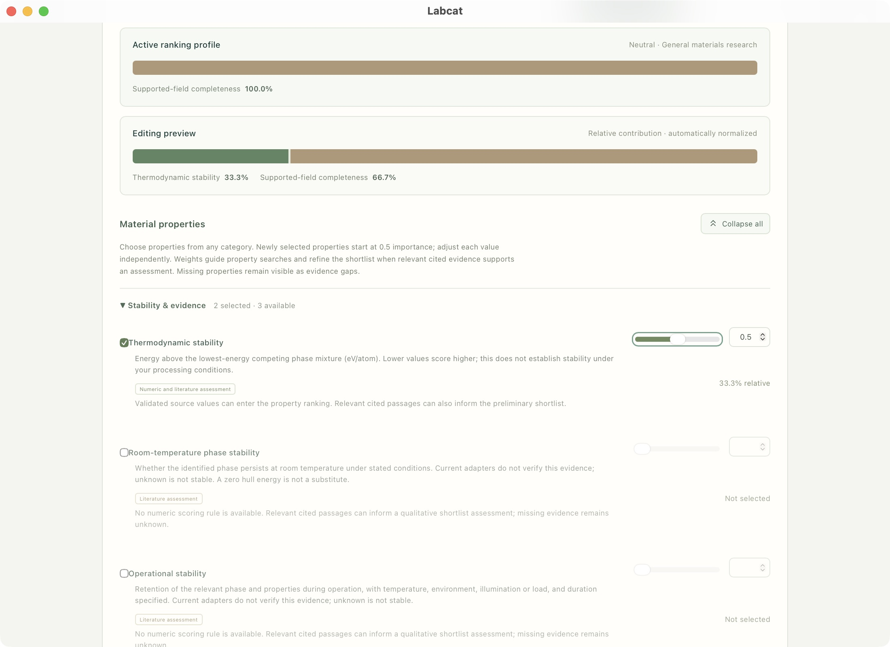
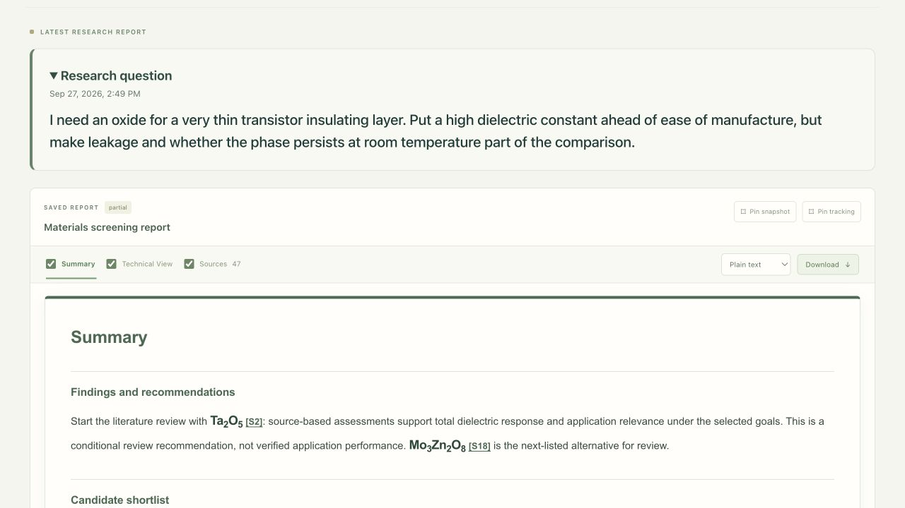
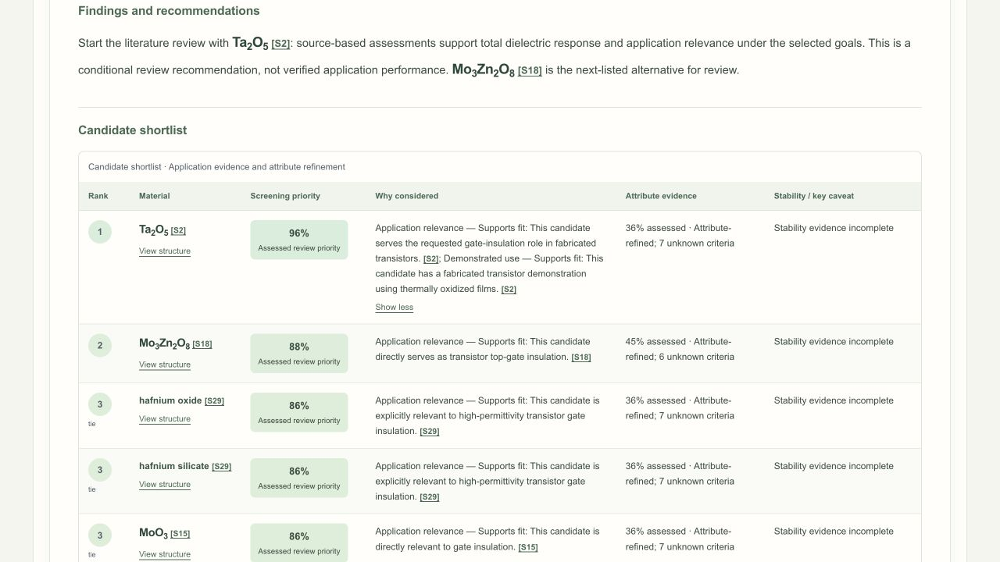
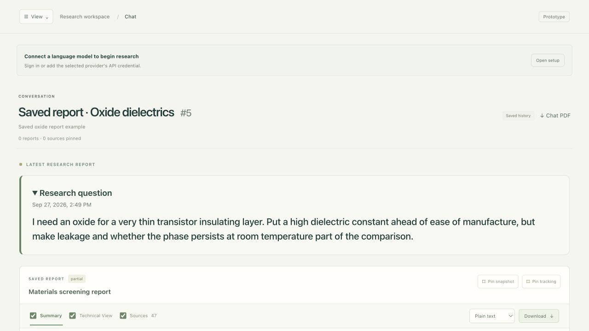
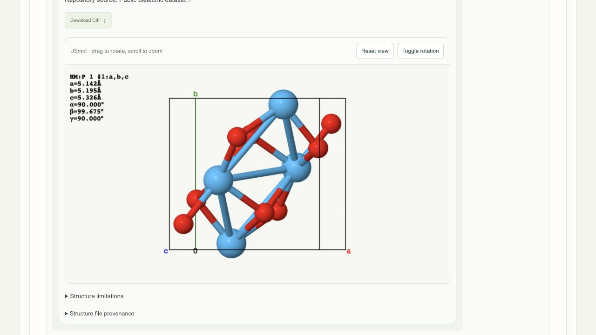
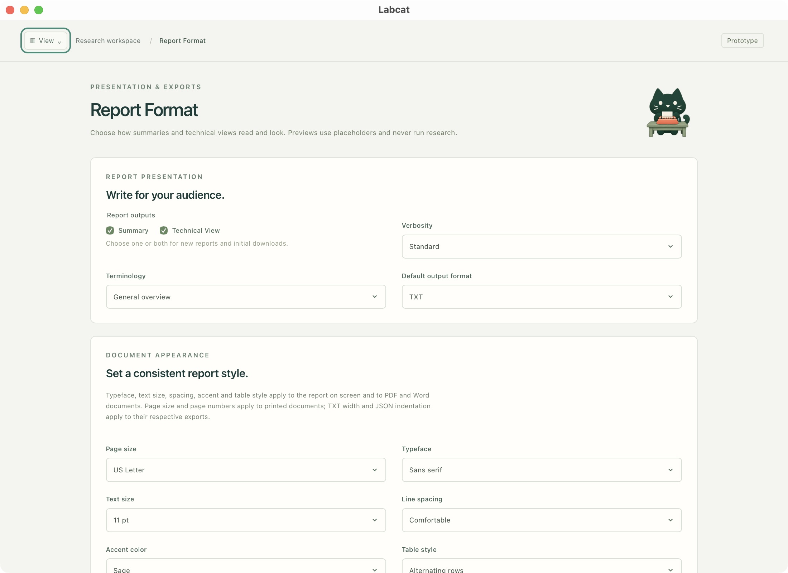
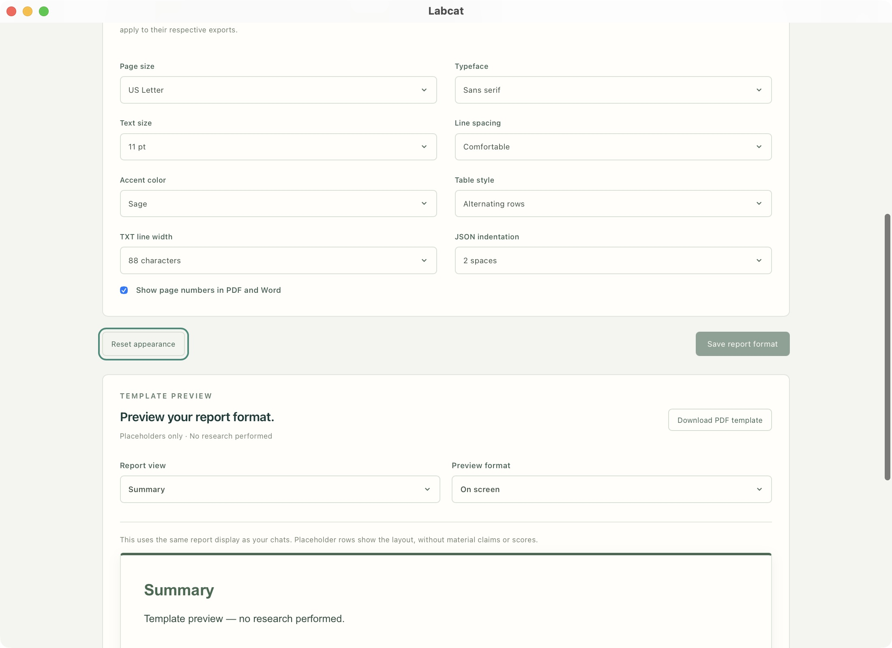

# Use Labcat

Ask a question, compare cited candidates, and keep related work together.
Start with [Install & setup](first-run.md) if this is your first launch.
Numbered outlines identify the controls; click any screenshot to enlarge it.

## Find your way around

1. **New chat** starts a separate conversation.
2. **Create project** groups related chats and their pinned reports.
3. **Search workspace** finds saved names, messages and reports locally.
4. **Connections**, **Search Criterion** and **Report Format** manage accounts,
   research preferences and presentation. The setup guide shows how to
   [connect or change a model](first-run.md#4-connect-your-model).

<svg viewBox="0 0 2200 1600" aria-hidden="true" focusable="false">
<rect x="32" y="204" width="313" height="78" rx="12" />
<circle cx="56" cy="189" r="30" /><text x="56" y="189">1</text>
<rect x="43" y="283" width="295" height="54" rx="12" />
<circle cx="67" cy="268" r="30" /><text x="67" y="268">2</text>
<rect x="32" y="343" width="313" height="68" rx="12" />
<circle cx="56" cy="328" r="30" /><text x="56" y="328">3</text>
<rect x="41" y="1260" width="296" height="194" rx="12" />
<circle cx="65" cy="1245" r="30" /><text x="65" y="1245">4</text>
</svg>

1. New chat. 2. Create project. 3. Search saved work. 4. Report Format, Search Criterion and Connections.

In **Create project**, enter a name and an optional description, then select
**Create project**. The new project includes an empty chat ready for a question.

<svg viewBox="0 0 2200 1600" aria-hidden="true" focusable="false">
<rect x="930" y="780" width="722" height="100" rx="12" />
<circle cx="954" cy="765" r="30" /><text x="954" y="765">1</text>
<rect x="930" y="922" width="722" height="168" rx="12" />
<circle cx="954" cy="907" r="30" /><text x="954" y="907">2</text>
<rect x="1437" y="1110" width="214" height="79" rx="12" />
<circle cx="1461" cy="1095" r="30" /><text x="1461" y="1095">3</text>
</svg>

1. Name the project. 2. Add an optional description. 3. Create the project.

## Ask a useful question

Describe the material's role, the properties you care about, and operating
conditions. See the [example prompts](examples.md) for starting points.

1. Enter your question in the prompt box.
2. Leave **Infer from prompt** selected for automatic priorities, or choose a
   saved profile. A manual selection takes precedence over inference.
3. Check the connected model and keep **Find reference structures** checked if
   you want structure discovery.
4. Click **Send**, or press **Command + Enter** / **Ctrl + Enter**.

<svg viewBox="0 0 2200 1600" aria-hidden="true" focusable="false">
<rect x="716" y="926" width="1150" height="173" rx="12" />
<circle cx="740" cy="911" r="30" /><text x="740" y="911">1</text>
<rect x="728" y="1112" width="260" height="76" rx="12" />
<circle cx="752" cy="1097" r="30" /><text x="752" y="1097">2</text>
<rect x="995" y="1112" width="636" height="76" rx="12" />
<circle cx="1019" cy="1097" r="30" /><text x="1019" y="1097">3</text>
<rect x="1723" y="1112" width="146" height="77" rx="12" />
<circle cx="1747" cy="1097" r="30" /><text x="1747" y="1097">4</text>
</svg>

1. Write the research question. 2. Choose automatic or saved criteria. 3. Check model and reference-structure lookup. 4. Send after connecting.

_This setup screenshot is before sign-in; sending requires a ready connection._

A running chat is marked by a flask. You may switch chats while research
continues. Keep the backend running: stopping it interrupts unfinished work.
Follow-ups in the same chat retain earlier questions and saved report revisions.

## Choose criteria and change their influence

Open **Search Criterion** from the sidebar. Choose an existing **Ranking profile**,
or select **New ranking profile** and give it a name. Presets are editable starting
points, not material recommendations.

<svg viewBox="0 0 2200 1600" aria-hidden="true" focusable="false">
<rect x="286" y="776" width="805" height="84" rx="12" />
<circle cx="310" cy="761" r="30" /><text x="310" y="761">1</text>
<rect x="1110" y="700" width="235" height="73" rx="12" />
<circle cx="1134" cy="685" r="30" /><text x="1134" y="685">2</text>
<rect x="286" y="944" width="1628" height="87" rx="12" />
<circle cx="310" cy="929" r="30" /><text x="310" y="929">3</text>
<rect x="1421" y="1186" width="493" height="99" rx="12" />
<circle cx="1445" cy="1171" r="30" /><text x="1445" y="1171">4</text>
</svg>

1. Select a saved profile. 2. Start a new profile. 3. Edit the name and preset. 4. Save; optionally make it the workspace default.

Scroll to **Material properties**. Select the properties you need and adjust each
importance from **0 to 1** with a slider or number field. Values need not add to
one; the preview shows their relative contribution. Keep at least one positive
importance. Return to **Save ranking profile**, then select its name in the
prompt's ranking control. **Use ranking profile** changes the workspace default.

<svg viewBox="0 0 2200 1600" aria-hidden="true" focusable="false">
<rect x="290" y="826" width="275" height="39" rx="12" />
<circle cx="314" cy="811" r="30" /><text x="314" y="811">1</text>
<rect x="1550" y="803" width="365" height="64" rx="12" />
<circle cx="1574" cy="788" r="30" /><text x="1574" y="788">2</text>
<rect x="310" y="355" width="1567" height="105" rx="12" />
<circle cx="334" cy="340" r="30" /><text x="334" y="340">3</text>
</svg>

1. Include a property. 2. Set its importance. 3. Check the normalized preview. These are illustrative preferences.

Automatic inference uses neutral exploration preferences when it cannot identify
a class or application. Check the profile recorded in each report. Changing
weights affects future research, not previously saved evidence; missing
properties remain missing. See [Sources & methods](resources.md).

## Read, compare and export

<svg viewBox="0 0 1280 720" aria-hidden="true" focusable="false">
<rect x="57" y="353" width="297" height="44" rx="7" style="stroke-width: 3" />
<circle cx="74" cy="343" r="19" /><text x="74" y="343" style="font-size: 22px">1</text>
<rect x="1010" y="351" width="215" height="47" rx="7" style="stroke-width: 3" />
<circle cx="1027" cy="341" r="19" /><text x="1027" y="341" style="font-size: 22px">2</text>
<rect x="1029" y="278" width="197" height="46" rx="7" style="stroke-width: 3" />
<circle cx="1046" cy="268" r="19" /><text x="1046" y="268" style="font-size: 22px">3</text>
</svg>

1. Switch views and choose export sections. 2. Choose an export type and download. 3. Pin a fixed snapshot or track the latest report.

Start with **Summary** for the shortlist, **Technical View** for detailed
assessments and comparisons, and **Sources** for the saved references. Expand
long explanations with **Read more**; **Show less** collapses them again.

<svg viewBox="0 0 1280 720" aria-hidden="true" focusable="false">
<rect x="474" y="278" width="318" height="126" rx="7" style="stroke-width: 3" />
<circle cx="491" cy="268" r="19" /><text x="491" y="268" style="font-size: 22px">1</text>
<rect x="170" y="524" width="86" height="28" rx="7" style="stroke-width: 3" />
<circle cx="187" cy="514" r="19" /><text x="187" y="514" style="font-size: 22px">2</text>
</svg>

1. Expanded explanation and Show less. 2. Open a candidate’s structure panel.

Check material identity, phase, sample conditions and missing evidence alongside
the ranking. Screening percentages indicate review priority, not confidence or
measured performance. A partial report retains useful findings with explicit gaps.

For an export, check the desired report sections, choose **Plain text**, **JSON**,
**PDF** or **Word (.docx)**, and select **Download**. Keep **Sources** selected for
citations. Exports use saved content without rerunning research.

<svg viewBox="0 0 1280 720" aria-hidden="true" focusable="false">
<rect x="1165" y="236" width="83" height="35" rx="7" style="stroke-width: 3" />
<circle cx="1182" cy="226" r="19" /><text x="1182" y="226" style="font-size: 22px">1</text>
<rect x="58" y="407" width="283" height="52" rx="7" style="stroke-width: 3" />
<circle cx="75" cy="397" r="19" /><text x="75" y="397" style="font-size: 22px">2</text>
</svg>

1. Download complete chat history. 2. Research question and original timestamp.

**Chat PDF** exports the complete saved conversation, including earlier questions
and report revisions. For project chats, **Pin snapshot** keeps a fixed report
revision; **Pin tracking** follows the latest completed report.

_The report screenshots show a genuine partial oxide report generated on
27 September 2026 with ChatGPT `gpt-6-astra`, reopened in the current interface.
The saved evidence and timestamps were preserved; these captures are not a new
research run or a guarantee of the same results._

## Inspect a structure

<svg viewBox="0 0 1280 720" aria-hidden="true" focusable="false">
<rect x="132" y="22" width="115" height="44" rx="7" style="stroke-width: 3" />
<circle cx="125" cy="42" r="19" /><text x="125" y="42" style="font-size: 22px">1</text>
<rect x="754" y="83" width="207" height="51" rx="7" style="stroke-width: 3" />
<circle cx="770" cy="73" r="19" /><text x="770" y="73" style="font-size: 22px">2</text>
<rect x="130" y="620" width="282" height="68" rx="7" style="stroke-width: 3" />
<circle cx="146" cy="610" r="19" /><text x="146" y="610" style="font-size: 22px">3</text>
</svg>

1. Download CIF. 2. Reset view or toggle rotation. 3. Read structure limitations and file provenance. The HfO₂ reference shown was retrieved from the public dielectric dataset; its phase match to the cited application is unverified.

In a shortlist, choose **View structure** and select an available record.
Drag in JSmol to rotate; scroll to zoom. **Reset view** restores the initial view.
Use **Download CIF** for available validated geometry.

Read the source and phase label. A reference may match composition without
matching the report's phase or sample. Separate core/shell component structures
are bulk references, not an assembled interface. Missing matches stay unavailable.
See the [resource list and JSmol acknowledgement](resources.md).

## Change report appearance

Open **Report Format** in the sidebar to change report verbosity, terminology,
export type and document appearance.

<svg viewBox="0 0 2200 1600" aria-hidden="true" focusable="false">
<rect x="287" y="607" width="378" height="61" rx="12" />
<circle cx="311" cy="592" r="30" /><text x="311" y="592">1</text>
<rect x="1112" y="646" width="803" height="86" rx="12" />
<circle cx="1136" cy="631" r="30" /><text x="1136" y="631">2</text>
<rect x="286" y="782" width="1628" height="89" rx="12" />
<circle cx="310" cy="767" r="30" /><text x="310" y="767">3</text>
</svg>

1. Choose report views. 2. Set verbosity. 3. Choose terminology and default export type.

Scroll down and choose **Save report format** after making changes. The template
preview contains placeholders, not research results. Formatting does not change
the saved evidence or ranking; pinned snapshots keep their recorded format.

<svg viewBox="0 0 2200 1600" aria-hidden="true" focusable="false">
<rect x="284" y="145" width="1634" height="591" rx="12" />
<circle cx="308" cy="130" r="30" /><text x="308" y="130">1</text>
<rect x="1706" y="808" width="253" height="81" rx="12" />
<circle cx="1730" cy="793" r="30" /><text x="1730" y="793">2</text>
<rect x="283" y="1001" width="1629" height="261" rx="12" />
<circle cx="307" cy="986" r="30" /><text x="307" y="986">3</text>
</svg>

1. Adjust document appearance. 2. Save changes. 3. Inspect the placeholder preview or download its PDF template.

